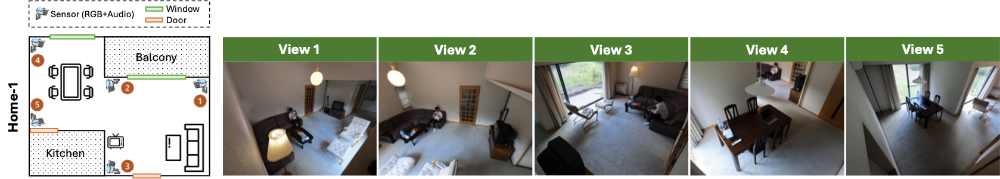

# MultiSensor-Home: Benchmark for Multi-modal Multi-view Action Recognition in Home Environments

A wide-area multi-modal multi-view dataset for action recognition and transformer-based sensor fusion research.

## 📖 Paper Reference

**MultiSensor-Home: A Wide-area Multi-modal Multi-view Dataset for Action Recognition and Transformer-based Sensor Fusion**

*This dataset is introduced in our paper. For detailed methodology, experimental results, and technical insights, please refer to the publication.*

- Source code: https://github.com/thanhhff/MultiTSF
- Download dataset: https://huggingface.co/datasets/thanhhff/MultiSensor-Home1/

A simple way to download the dataset:
```
# Make sure hf CLI is installed: pip install -U "huggingface_hub[cli]"
hf download thanhhff/MultiSensor-Home1 --repo-type=dataset --local-dir dataset 
```

## 📊 Dataset Overview

MultiSensor-Home is a comprehensive multi-view action recognition dataset captured in a real home environment. The dataset features:

- **Multi-view Setup**: 5 synchronized camera views (View1-View5)
- **High-resolution**: Original resolution 4000×3000 pixels (available upon request)
- **Optimized for Deep Learning**: Resized to 320×240 pixels for efficient training
- **Temporal Annotations**: Precise start/end timestamps for each action
- **Real-world Scenarios**: Natural human activities in home environment
- **Action Classes**: 16 different action classes in this environment

**Note**: The original high-resolution dataset (4000×3000 pixels) is available upon request. Please contact: nguyent@cs.is.i.nagoya-u.ac.jp

## 🏠 Room Layout and Camera Setup



*Home1 floor plan showing camera positions and room layout*

- **Room Layout**: Complete floor plan of the home environment
- **Camera Positions**: Exact placement of all 5 cameras (View1-View5)
- **Camera Orientations**: Direction and field of view for each camera
- **Room Dimensions**: Spatial measurements and room configurations
- **Recording Environment**: Overview of the home setup used for data collection

This layout file is essential for understanding the spatial relationships between different camera views and the overall recording environment.


## 🏠 Dataset Structure

```
MultiSensor-Home1/
├── 01/                    # Recording session 1
├── 02/                    # Recording session 2
├── 03/                    # Recording session 3
├── 04/                    # Recording session 4
├── 05/                    # Recording session 5
├── 06/                    # Recording session 6
├── 07/                    # Recording session 7
├── 08/                    # Recording session 8
├── all_labels.json        # Complete annotations
├── train.json             # Training split annotations
├── test.json              # Test split annotations
└── README.md              # This file
```

## 📹 Video File Naming Convention

Videos follow the pattern: `{id}-{View}{number}-Part{part}.mp4`

**Examples:**
- `00-View1-Part1.mp4` - ID 00, View 1, Part 1
- `15-View3-Part2.mp4` - ID 15, View 3, Part 2
- `23-View5-Part1.mp4` - ID 23, View 5, Part 1

## 🏷️ Action Classes

The dataset contains **16 action classes** covering various human activities in the home environment:

- **Basic Movements**: Sitdown, Standup, Enter, Exit
- **Device Usage**: UseLaptop, UsePhone, ReadBook
- **Environmental Control**: TurnOnLamp, TurnOffLamp, AdjustAC
- **Home Activities**: OpenCurtain, CloseCurtain, Eat, Drink
- **And more...**

## 📋 Annotation Format

Each video segment is annotated with:

```json
{
  "video_url_1": "01/00-View1-Part1.mp4",
  "video_url_2": "01/00-View2-Part1.mp4",
  "video_url_3": "01/00-View3-Part1.mp4",
  "video_url_4": "01/00-View4-Part1.mp4",
  "video_url_5": "01/00-View5-Part1.mp4",
  "tricks": [
    {
      "start": 3.2472731152647976,
      "end": 6.1332581718146235,
      "labels": ["Sitdown"]
    },
    {
      "start": 7.524156360433797,
      "end": 59.07342151340292,
      "labels": ["ReadBook"]
    }
  ]
}
```

### Annotation Fields:
- **video_url_1-5**: Paths to the 5 synchronized video views
- **start/end**: Temporal boundaries in seconds
- **labels**: Action label for the time segment


## 📧 Original High-Resolution Dataset

The original dataset at full resolution (4000×3000 pixels) is available upon request.

Please include:
- Your name and affiliation
- Intended use of the dataset
- Brief description of your research

## 📄 License and Citation

When using this dataset, please cite our paper:

```bibtex
@inproceedings{nguyen2025multisensor,
  author    = {Trung Thanh Nguyen and Yasutomo Kawanishi and Vijay John and Takahiro Komamizu and Ichiro Ide},
  title     = {MultiSensor-Home: A Wide-area Multi-modal Multi-view Dataset for Action Recognition and Transformer-based Sensor Fusion},
  booktitle = {Proceedings of the 19th IEEE International Conference on Automatic Face and Gesture Recognition},
  year      = {2025},
  note      = {Best Student Paper Award}
}
```

## 🤝 Contributing

We welcome contributions and feedback. If you find any issues or have suggestions for improvements, please contact us.

## 📞 Contact

For questions about the dataset, paper, or to request the original high-resolution version:

**Email**: nguyent [at] cs.is.i.nagoya-u.ac.jp


## Acknowledgment
This work was partly supported by Japan Society for the Promotion of Science (JSPS) KAKENHI JP21H03519 and JP24H00733.

---

*This dataset is designed to advance research in multi-view action recognition, sensor fusion, and transformer-based approaches for understanding human activities in real-world environments.*
